# 6G-Bench
**An Open Benchmark for Semantic Communication and Network-Level Reasoning in AI-Native 6G Networks**

**Research paper** : https://arxiv.org/pdf/...

👉 If you are looking to evaluate your LLM model using our benchmark, please feel free to contact us at 📩 mohamed.ferrag@uaeu.ac.ae / mohamed.amine.ferrag@gmail.com


## Overview
**6G-Bench** is an open, standardized benchmark for evaluating **semantic communication** and **network-level reasoning** capabilities of foundation models in **AI-native 6G networks**.

Unlike existing telecom benchmarks that emphasize isolated tasks, factual knowledge, or numeric optimization, 6G-Bench focuses on **decision-making over meaning-bearing abstractions**, including:
- network intents and policies,
- slicing and resource management,
- trust, security, and SLA awareness,
- multi-agent coordination and agentic control,
- distributed intelligence and emerging 6G use cases.

The benchmark is grounded in **ongoing 6G standardization activities** (3GPP, IETF, ETSI, ITU-T, O-RAN Alliance) and evaluates whether foundation models can act as **semantic reasoning layers above standardized network functions**.

---

## Key Contributions
- **Standardization-aligned task taxonomy**  
  30 decision-making tasks (T1–T30) organized into five capability categories derived from 6G and AI-agent standardization efforts.

- **Network-level semantic reasoning under uncertainty**  
  Tasks require multi-step reasoning over intent, policy, trust, and future consequences using worst-case regret minimization.

- **Large-scale and high-difficulty benchmark**  
  - 113,475 source scenarios  
  - 10,000 very-hard MCQs generated  
  - 3,722 expert-validated MCQs released for evaluation

- **Rigorous validation pipeline**  
  Automated structural checks combined with human expert review to ensure semantic correctness and uniqueness.

- **Comprehensive model evaluation**  
  Evaluation of 22 state-of-the-art foundation models spanning dense and MoE architectures, open-weight and proprietary systems, and short- to long-context designs.

---

## Capability Categories
6G-Bench defines five standardization-aligned capability groups:

1. **Intent & Policy Reasoning**  
   Intent feasibility assessment, conflict resolution, intent drift detection, and conservative decision-making under uncertainty.

2. **Network Slicing & Resource Management**  
   Slice selection and switching, compute placement, graceful degradation, SLA violation prediction, and energy-aware decisions.

3. **Trust, Security & SLA Awareness**  
   Trust-aware offloading, agent identity and onboarding, third-party exposure control, and automated security response.

4. **AI-Native Networking & Agentic Control**  
   Agent interoperability, agent-to-agent communication, lifecycle management, and network-knowledge RAG decisions.

5. **Distributed Intelligence & Emerging 6G Use Cases**  
   Federated learning orchestration, ISAC decisioning, digital twins, disaster response, and immersive services.

---

## Problem Formulation
Each benchmark instance represents a **semantic decision under uncertainty**.

Given a truncated multi-turn trajectory capturing:
- mission or service intent,
- 6G network state (latency, throughput, packet loss, edge-compute load),
- policy and SLA constraints,
- agent operational context,

The model must select the action that **minimizes worst-case future regret** over a finite horizon.

All questions are **multiple-choice (A–D)** but require:
- multi-step quantitative reasoning,
- uncertainty-aware projection,
- policy and trust constraint evaluation,
- comparison of future consequences.

---
## Benchmark Design

The overall benchmark design and pipeline are illustrated below:

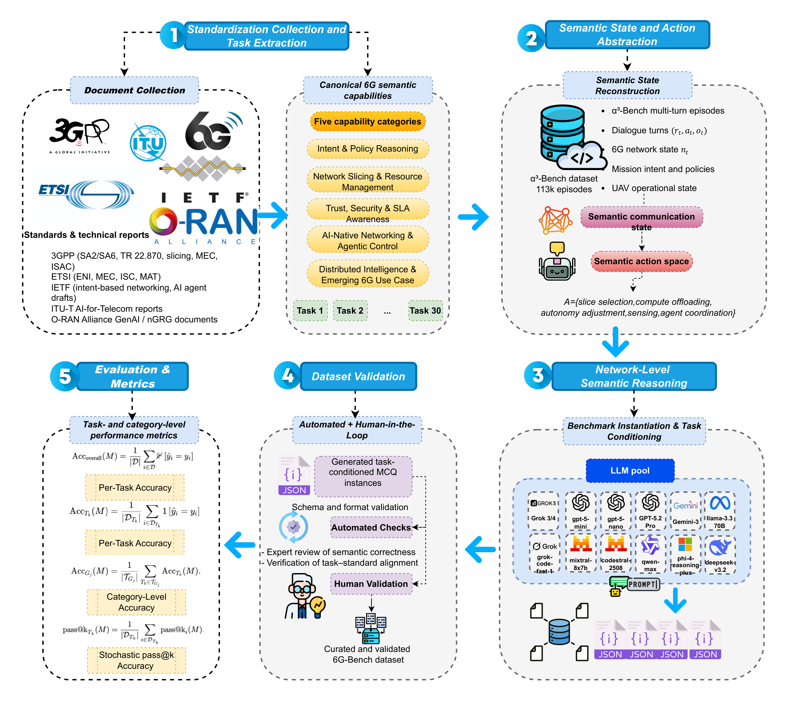

The pipeline consists of:
1. **Standardization Collection and Task Extraction**  
2. **Semantic State and Action Abstraction**  
3. **Network-Level Semantic Reasoning & Task Conditioning**  
4. **Dataset Validation (Automated + Human-in-the-Loop)**  
5. **Evaluation & Metrics**

### Task Coverage

The distribution of questions across capability categories and individual tasks is shown below:

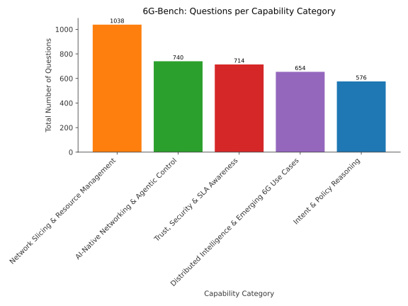

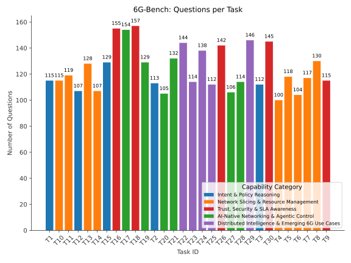


---

## Evaluation Protocol
6G-Bench provides a unified and reproducible evaluation methodology:

- **Deterministic pass@1 accuracy**
- **Per-task accuracy** (T1–T30)
- **Group-level accuracy** (five capability categories)
- **Selective pass@k accuracy** for reasoning-intensive tasks

Models are evaluated using **task-conditioned prompts** and must return a structured response:

```json
{"answer": "..."}
```

<details>
<summary>Click to expand JSON example</summary>

```json
{
  "episode_id": "6gb_prompt_b6cae3e064075b42",
  "questions": [
    {
      "task_id": "T1",
      "task_name": "Intent Feasibility Assessment",
      "source_turn": 6,
      "question": "A UAV mission is ongoing inside a geofenced area with altitude bounds of 50 to 450 meters, and the UAV is currently flying at 150 meters with speed 22 mps and battery at 100 percent. At turn 6, the operator issues a new 6G intent message requesting continuous real time visual inspection while transiting to the next waypoint, explicitly requiring end to end latency below 20 ms, packet loss below 1 percent, and stable control over the next two to three turns. At the same time, the network slice has shifted to mMTC with latency between 115 and 120 ms, jitter around 25 to 28 ms, loss between 7.5 and 8 percent, throughput about 1.2 to 1.5 Mbps, and edge load fluctuating around 0.85 to 0.88. In earlier turns on URLLC, latency was 7 to 10 ms with loss below 0.1 percent, but that recovery has not yet occurred at the moment of the intent. Weather remains dusty with wind at 8.5 mps, and no altitude policy changes are allowed beyond the stated bounds. Given these numeric constraints, trends across turns, and uncertainty in the degraded network metrics, is the intent feasible as stated, or what adjustment is minimally required to make it feasible without violating policy or safety over the next few turns?",
      "options": {
        "A": "The intent is feasible as stated because the UAV altitude and battery are within limits and throughput above 1 Mbps is sufficient for visual inspection if resolution is reduced.",
        "B": "The intent is infeasible unless the UAV immediately climbs toward the upper altitude bound near 450 meters to escape congestion, while keeping the same real time inspection requirement.",
        "C": "The intent is infeasible as stated and requires relaxing the real time latency and loss requirements or deferring inspection until the network returns to URLLC levels seen earlier.",
        "D": "The intent is feasible by maintaining real time inspection but switching permanently to the mMTC slice and accepting higher jitter since control was stable in the previous turn."
      },
      "correct": "C",
      "reason": "The intent explicitly requires latency below 20 ms and loss below 1 percent, but the current and near future network shows latency above 115 ms and loss near 8 percent with uncertainty that keeps it far outside bounds. Earlier URLLC performance does not guarantee recovery within the next two to three turns, especially with edge load fluctuating around 0. 88. Altitude and battery constraints are satisfied, but they do not mitigate the network violations. Relaxing the real time requirements or deferring the inspection is the least bad adjustment that restores feasibility without violating policy or assuming an unsafe recovery.",
      "rationale_tag": "FEASIBILITY_UNDER_DEGRADATION",
      "difficulty": "very_hard"
    },
    {
      "task_id": "T2",
      "task_name": "Intent Conflict Resolution",
      "source_turn": 6,
      "question": "By turn 6 the UAV is mid-mission inside a geofenced area with altitude 150 m within the 50–450 m policy bounds and speed 22 mps, but the network has degraded after a slice change. Over turns 6 and 7 the slice is mMTC with latency fluctuating between 115 and 120 ms, jitter around 25 ± 3 ms, loss between 7.5% and 8%, throughput near 1.2–1.5 Mbps, and edge_load around 0.85–0.88. The mission intent still prioritizes inspection data delivery, while network policy favors URLLC for control and collision avoidance, which earlier operated at 7–10 ms latency, loss below 0.1%, and edge_load under 0.6. Continuing high-rate data handling under mMTC risks delayed control updates over the next few turns as edge_load trends upward, but immediately pausing data delivery undermines the inspection objective. Given these numeric trends, uncertainty ranges, and the need to resolve the conflict between mission intent and network policy over the next 1–3 turns, what is the least-bad resolution?",
      "options": {
        "A": "Continue inspection data transmission on the mMTC slice because 1.5 Mbps throughput is nonzero and the altitude and battery are still well within limits, accepting the 115–120 ms latency temporarily.",
        "B": "Force an immediate switch to eMBB to upload inspection data since it previously delivered 800+ Mbps at 14 ms latency, even though edge_load was already around 0.72 and control traffic would share the slice.",
        "C": "Defer noncritical data delivery and prioritize URLLC for control and safety traffic until latency returns below 10 ms and loss below 0.1%, accepting a short-term mission delay.",
        "D": "Abort the mission and return to base immediately because any loss above 7% violates acceptable communication quality regardless of slice or future trends."
      },
      "correct": "C",
      "reason": "The mMTC conditions show sustained high latency, jitter, and loss with uncertainty that risks control instability as edge load remains near saturation. URLLC previously demonstrated an order of magnitude lower latency and loss, which directly aligns with network policy for safe operation during flight. Option A ignores the trend and uncertainty, while option B optimizes throughput but increases contention for control traffic under rising edge load. Option D overreacts by sacrificing mission objectives despite a viable policy-compliant mitigation.",
      "rationale_tag": "INTENT_POLICY_TRADEOFF",
      "difficulty": "very_hard"
    },
    {
      "task_id": "T3",
      "task_name": "Intent Drift Detection",
      "source_turn": 10,
      "question": "A UAV mission begins with inspection and swarm coordination under tight control requirements, using URLLC with latency between 7 and 9 ms, jitter around 1 to 2 ms, and loss near 0.05% across turns 3 to 5. At turn 6, the network degrades sharply to mMTC with latency about 120 ms, jitter 25 to 28 ms, loss between 7.5% and 8%, and edge load fluctuating around 0.85 to 0.88, after which the agent adapts by reducing streaming quality. By turns 8 and 9, the system returns to URLLC with latency near 9 to 10 ms and throughput around 95 to 105 Mbps, consistent with inspection and control. At turn 10, the user requests bulk data upload, switching to eMBB with latency 14 ms, jitter 4 ms, loss 0.2%, throughput 800 Mbps, and edge load 0.72, which prioritizes bandwidth over control stability. Considering the prior intent, the temporal evolution of network slices, and the quantitative trade-offs under fluctuating edge load, which interpretation best indicates a subtle mid-mission intent drift rather than a benign adaptation?",
      "options": {
        "A": "There is no intent drift because latency at turn 10 remains below 15 ms and loss stays under 0.5%, which is numerically acceptable for both inspection and upload tasks.",
        "B": "There is intent drift because the shift from URLLC back to eMBB at turn 10 optimizes for 800 Mbps throughput despite earlier adaptation to instability at edge load near 0.85, indicating a move from control-centric inspection to data exfiltration.",
        "C": "There is no intent drift because edge load decreases from about 0.88 to 0.72 by turn 10, making high-throughput upload a safe continuation of the mission.",
        "D": "There is intent drift only if battery percentage is below 50%, since higher throughput at 800 Mbps would otherwise not conflict with inspection objectives."
      },
      "correct": "B",
      "reason": "The mission initially emphasizes low latency and reliability, as shown by sustained URLLC use with single digit latency and minimal loss during inspection and coordination. After experiencing severe degradation, the agent adapts conservatively, reinforcing a control-focused intent. The later switch to eMBB prioritizes throughput over control margins even though edge load remains high and variable, which is inconsistent with the earlier safety driven adaptations. This temporal and quantitative shift signals a change in underlying intent rather than a simple network optimization.",
      "rationale_tag": "INTENT_DRIFT_NETWORK_SLICE",
      "difficulty": "very_hard"
    },
    {
      "task_id": "T4",
      "task_name": "Slice Selection Reasoning",
      "source_turn": 10,
      "question": "During the mission, the UAV alternates between control-critical maneuvers and high-volume data transfer. From turns 3 to 5, URLLC shows latency between 7 and 9 ms with jitter 1–2 ms, loss around 0.04%–0.06%, and throughput near 100–120 Mbps while edge load rises from 0.38 to 0.52. At turn 6 and 7, a degradation occurs on a low-capacity slice with latency roughly 115–120 ms, jitter 25–28 ms, loss 7.5%–8%, and edge load near 0.85–0.88, forcing reduced streaming. By turn 8 and 9, URLLC stabilizes again at about 9–10 ms latency, loss near 0.05%–0.08%, throughput around 95–105 Mbps, and edge load around 0.58–0.61, enabling inspection. At turn 10, a queued image upload switches to eMBB with latency 14 ± 2 ms, jitter about 4 ms, loss near 0.2%, throughput roughly 800 Mbps, and edge load around 0.72, while a return-to-base maneuver is imminent in the next turn. Considering the next 1–3 turns, the uncertainty in latency and edge load, and the need to balance control safety with timely data delivery, which slice choice is the least risky overall for this phase?",
      "options": {
        "A": "Stay on pure eMBB because 800 Mbps throughput easily clears the upload queue, and latency around 14 ms remains acceptable even if jitter stays near 4 ms.",
        "B": "Switch immediately to pure URLLC because its 8–10 ms latency and sub-0.1% loss provide maximum safety margin for the return maneuver, accepting slower uploads.",
        "C": "Adopt a hybrid slice that prioritizes URLLC for control while allocating eMBB capacity for background uploads, tolerating edge load around 0.7 but keeping latency below about 12 ms.",
        "D": "Delay all uploads and force a low-capacity slice similar to turns 6–7 to minimize edge load impact, even though latency may exceed 100 ms with loss above 7%."
      },
      "correct": "C",
      "reason": "A hybrid slice balances the need for low and predictable latency for control with sufficient throughput for uploads, even when edge load fluctuates around 0. 7. Pure eMBB looks attractive short term for throughput, but its higher and uncertain latency reduces safety margin during the imminent return. Pure URLLC preserves safety but prolongs data transfer and risks backlog if the next turns require more uploads. The degraded low-capacity option already showed unacceptable latency and loss under similar conditions.",
      "rationale_tag": "RISK_AWARE_SLICE_TRADEOFF",
      "difficulty": "very_hard"
    },
    {
      "task_id": "T5",
      "task_name": "Slice Switching Decision",
      "source_turn": 10,
      "question": "At turn 10 the UAV has finished inspection and queued a data upload, after which it immediately begins a return-to-base maneuver that requires tight control and collision avoidance. Over the last few turns, URLLC has shown latency between 8 and 10 ms with jitter 1 to 2 ms, loss around 0.04% to 0.08%, and throughput near 95 to 115 Mbps while edge_load sits near 0.5 to 0.6. In contrast, eMBB at turn 10 offers much higher throughput around 800 Mbps but latency 14 ms, jitter 4 ms, loss 0.2%, and an edge_load that has risen to about 0.72 and is fluctuating in a range roughly between 0.7 and 0.8. Earlier degradation on mMTC showed how high edge_load near 0.85 to 0.88 coincided with unstable latency and loss. Given the immediate need for stable control over the next one to three turns and the observed trends and uncertainty, which decision best matches the task of deciding when not to switch slices despite apparent degradation?",
      "options": {
        "A": "Switch to eMBB immediately because its 800 Mbps throughput at 14 ms latency is still close to URLLC latency and supports faster data upload during return.",
        "B": "Remain on URLLC despite lower throughput because its consistently lower latency, jitter, and loss with edge_load around 0.5 to 0.6 are more robust under short-term uncertainty.",
        "C": "Switch to mMTC temporarily since its throughput has recovered from 1.2 to 1.5 Mbps and edge_load dropped from 0.88 to 0.85 after adaptation.",
        "D": "Alternate between URLLC and eMBB every turn to average latency near 12 ms while keeping mean throughput above 450 Mbps."
      },
      "correct": "B",
      "reason": "The return maneuver depends more on stable low latency and low jitter than peak throughput over the next few turns. URLLC shows a narrow range of 8 to 10 ms latency and low loss while eMBB already has higher latency and an edge load fluctuating up to about 0. 8, which risks further degradation. The earlier mMTC episode demonstrates that high edge load correlates with rapid instability, making eMBB risky under uncertainty. Staying on URLLC sacrifices throughput but minimizes control risk, which aligns with deciding not to switch despite apparent degradation.",
      "rationale_tag": "RISK_AWARE_STABILITY",
      "difficulty": "very_hard"
    },
    {
      "task_id": "T6",
      "task_name": "Slice Fairness vs Safety",
      "source_turn": 6,
      "question": "During a multi-UAV inspection mission, one UAV observes a sharp network degradation while coordinating with nearby swarm members for collision avoidance. From turns 3 to 5, safety-critical coordination ran on URLLC with latency between 7 and 9 ms, jitter 1 to 2 ms, loss around 0.04% to 0.06%, and edge load rising from 0.38 to 0.52. At turn 6, the slice drops to mMTC with latency around 120 ms with an uncertainty of plus or minus 10 ms, jitter about 25 ms, loss near 8%, throughput 1.2 Mbps, and edge load peaking at 0.88, while other swarm members still require collision avoidance within sub-10 ms latency. Policy prioritizes safety traffic but also requires avoiding starvation of non-safety UAV telemetry over the next two turns. Considering fairness across the swarm, safety guarantees for collision avoidance, and the trend of increasing edge load and unstable latency, which slice reallocation or contention resolution decision best satisfies the definition of Slice Fairness vs Safety over the next 1 to 3 turns?",
      "options": {
        "A": "Keep all UAVs on the current mMTC slice to preserve fairness, accepting 110 to 130 ms latency and 7% to 9% loss temporarily since collision avoidance already succeeded earlier.",
        "B": "Immediately migrate all swarm traffic to URLLC, even though throughput is only about 100 Mbps and edge load has already reached 0.52 to 0.61, to equalize treatment and minimize latency.",
        "C": "Reserve URLLC only for collision avoidance messages while throttling non-safety telemetry to eMBB, accepting higher edge load near 0.72 and latency around 14 ms for uploads to protect sub-10 ms safety paths.",
        "D": "Split the swarm evenly between URLLC and eMBB regardless of role, assuming average latency will remain below 15 ms and edge load below 0.7 for everyone."
      },
      "correct": "C",
      "reason": "Option C explicitly prioritizes safety-critical traffic under URLLC while redirecting non-safety data to eMBB, which keeps collision avoidance within the previously observed 7 to 9 ms latency even as edge load rises. It manages fairness by not starving other UAVs, since eMBB still provides high throughput around 800 Mbps at about 14 ms latency. Option A ignores the uncertainty range that pushes mMTC latency far beyond safe bounds, while option B risks URLLC overload as edge load trends upward. Option D assumes stable averages and ignores role-based safety requirements under worsening network conditions.",
      "rationale_tag": "FAIRNESS_UNDER_SAFETY_CONSTRAINTS",
      "difficulty": "very_hard"
    },
    {
      "task_id": "T7",
      "task_name": "Compute Placement Decision",
      "source_turn": 9,
      "question": "During the inspection at turn 9, the UAV must run an object detection model either onboard or offloaded to the edge. The application SLA implicitly matches what has been sustaining stable inspection earlier, namely end to end latency at or below about 10 ms, packet loss not exceeding roughly 0.1%, and throughput near 100 Mbps to support image frames. Over the last three network phases, URLLC links showed latency of 7 to 10 ms with loss 0.04% to 0.08% and edge_load around 0.5 to 0.6, while the earlier mMTC degradation had latency 115 to 120 ms, loss 7.5% to 8%, throughput near 1.2 to 1.5 Mbps, and edge_load fluctuating around 0.85 to 0.88. Current conditions at turn 9 are URLLC with latency 9 ms, jitter 1 ms, loss 0.05%, throughput 105 Mbps, and edge_load 0.58, but recent history shows slice changes can happen within one to two turns. Onboard inference avoids network latency but sacrifices the chance to upload results immediately, while edge inference risks future congestion if load spikes again toward 0.8 plus. Considering the SLA and the quantitative trends with uncertainty in edge_load, which compute placement is the least risky choice for the next one to two turns?",
      "options": {
        "A": "Choose edge inference now because 9 ms latency and 105 Mbps throughput meet the SLA and edge_load at 0.58 leaves enough margin even if it increases slightly.",
        "B": "Choose onboard inference now because it guarantees sub 10 ms response independent of possible slice regression to mMTC with 115 to 120 ms latency and 7.5% to 8% loss.",
        "C": "Choose edge inference only if the slice stays URLLC, assuming loss remains below 0.08% and edge_load does not exceed 0.72 as seen on eMBB.",
        "D": "Delay inference for one turn to wait for eMBB conditions since throughput of 800 Mbps at 14 ms latency can compensate for higher jitter."
      },
      "correct": "B",
      "reason": "Edge inference currently satisfies the SLA, but recent turns show rapid transitions to mMTC where latency jumps above 115 ms and loss rises well beyond acceptable bounds. The uncertainty in edge_load, which already reached 0. 88 earlier, makes future edge processing fragile over the next one to two turns. Onboard inference removes dependence on variable latency and loss and thus preserves the latency and reliability margin required by inspection. Options relying on edge or waiting for eMBB ignore the demonstrated volatility and exceed the implicit latency or loss limits when conditions worsen.",
      "rationale_tag": "SLA_ROBUST_PLACEMENT",
      "difficulty": "very_hard"
    },
    {
      "task_id": "T8",
      "task_name": "Graceful Degradation under Edge Overload",
      "source_turn": 7,
      "question": "During a UAV mission, network conditions deteriorate over several turns while the vehicle is still operating autonomously. At turn 5, the URLLC slice shows latency 9 ms, loss 0.06%, and edge_load 0.52, but by turn 6 the slice switches to mMTC with latency 120 ms, jitter 25 ms, loss 8.0%, throughput 1.2 Mbps, and edge_load 0.88. At turn 7, after a minor adaptation, latency improves only to 115 ms with jitter 28 ms, loss 7.5%, throughput 1.5 Mbps, and edge_load 0.85, which is fluctuating in the range 0.83 to 0.90 due to dust-related interference. The SLA for autonomous perception requires staying below roughly 100 ms latency and below 5% loss, and violations persisting for more than one turn are considered unsafe. Although switching back to URLLC later has previously restored low latency near 10 ms and loss below 0.1%, that recovery is not guaranteed within the next two turns if overload continues. Given these quantitative trends, uncertainty ranges, and the need to reduce autonomy level before an SLA violation, which degradation strategy is the least-bad choice to apply now?",
      "options": {
        "A": "Maintain full autonomy because latency improved from 120 ms to 115 ms and hope edge_load drops below 0.8 in the next turn, since throughput also increased from 1.2 to 1.5 Mbps.",
        "B": "Immediately switch to manual or supervised autonomy with minimal onboard decision-making, reducing data exchange demands, because current loss 7.5% plus possible spikes toward 8%–9% exceed SLA even if latency marginally improves.",
        "C": "Keep autonomy but reduce only video resolution further, assuming that lowering throughput demand will push latency under 100 ms despite edge_load remaining around 0.85 to 0.90.",
        "D": "Delay any autonomy reduction until the slice switches back to URLLC, because previous turns show URLLC latency near 10 ms and loss below 0.1%, making degradation unnecessary now."
      },
      "correct": "B",
      "reason": "The metrics at turns 6 and 7 already exceed both latency and loss thresholds, and the uncertainty range of edge_load up to 0. 90 makes continued violation likely. Maintaining autonomy or making only minor adjustments focuses on short-term throughput changes and ignores that loss remains well above 5% across turns. Waiting for a possible slice recovery assumes a future improvement that is not guaranteed within the next one to two turns. Reducing autonomy immediately is the most risk-aware way to prevent a sustained SLA violation under overload.",
      "rationale_tag": "EDGE_OVERLOAD_RISK_AWARE",
      "difficulty": "very_hard"
    },
    {
      "task_id": "T9",
      "task_name": "Trust-Aware Offloading",
      "source_turn": 10,
      "question": "At turn 10 the user requests a data upload to the edge with high priority after images were captured on turn 9. Over the previous turns the network showed a severe degradation on mMTC with latency 115 to 120 ms, jitter 25 to 28 ms, loss 7.5% to 8.0%, and edge_load peaking at 0.88, followed by recovery on URLLC with latency 9 to 10 ms, loss 0.05% to 0.08%, and edge_load around 0.58 to 0.61. The upload request is queued on eMBB where latency is 14 ms, jitter 4 ms, loss 0.2%, throughput 800 Mbps, and edge_load 0.72 that is known to fluctuate around 0.7 with occasional spikes above 0.8 under dust and wind conditions. Mission policy requires rejecting edge offloading if recent instability or high load creates a trust risk that could compromise data integrity over the next one to three turns. Battery remains high, but the UAV is transitioning to return-to-base, reducing tolerance for retransmissions. Given these numeric trends, uncertainties, and trust constraints, which decision best satisfies trust-aware offloading policy?",
      "options": {
        "A": "Proceed with immediate edge offloading on eMBB because throughput 800 Mbps and latency 14 ms comfortably outperform earlier slices despite edge_load around 0.72.",
        "B": "Delay the offload by one turn to confirm edge_load stays below 0.7 and loss remains under 0.2%, then offload if the metrics stabilize.",
        "C": "Reject edge offloading and store data locally until return-to-base because recent loss up to 8%, edge_load spikes near 0.88, and current load uncertainty create a trust violation risk.",
        "D": "Partially offload a compressed subset now while keeping the rest local, assuming reduced data size offsets the risk from edge_load fluctuations."
      },
      "correct": "C",
      "reason": "The recent history includes loss as high as 7. 5% to 8. 0% and edge_load near 0. 88, which undermines trust even though current eMBB metrics look good. Edge_load at 0.",
      "rationale_tag": "TRUST_RISK_REJECTION",
      "difficulty": "very_hard"
    },
    {
      "task_id": "T10",
      "task_name": "SLA Violation Prediction",
      "source_turn": 7,
      "question": "At turn 7, the UAV has just adapted to a severe network degradation after switching to an mMTC slice. Over turns 6 and 7, latency increased from 120 ms to 115 ms, jitter rose from 25 ms to about 28 ms, loss stayed high around 7.5% to 8.0%, throughput remained very low at roughly 1.2 to 1.5 Mbps, and edge load stayed elevated near 0.85 to 0.88 with possible short spikes above 0.9. The mission policy implicitly assumes that for safe command and control, latency should stay below about 50 ms, loss below 1%, and edge load below 0.8, even if brief fluctuations are tolerated. In earlier turns on URLLC, latency was consistently between 7 and 10 ms with loss under 0.1%, showing a strong contrast in trends. Considering the last two turns, the uncertainty in jitter and edge load, and the likelihood of conditions persisting over the next 1 to 3 turns, which option best predicts whether an SLA violation is likely to occur if no further corrective action is taken?",
      "options": {
        "A": "An SLA violation is unlikely because latency slightly improved from 120 ms to 115 ms and throughput increased from 1.2 to 1.5 Mbps, suggesting stabilization despite high loss.",
        "B": "An SLA violation is likely because latency and loss remain far above acceptable limits, and edge load around 0.85 to 0.88 with possible spikes makes compliance improbable over the next few turns.",
        "C": "An SLA violation is unlikely because jitter, although high at about 28 ms, is secondary to throughput, and throughput shows a small upward trend.",
        "D": "An SLA violation is uncertain but avoidable because switching slices previously reduced latency to under 10 ms, so the current degradation is likely transient without further impact."
      },
      "correct": "B",
      "reason": "Latency remains more than twice a typical control threshold and loss is an order of magnitude above acceptable levels even after adaptation. Edge load hovering near 0. 85 with uncertainty up to 0. 9 indicates sustained congestion that is unlikely to clear within the next few turns. The small improvements in latency and throughput do not offset the persistent violation of multiple SLA dimensions.",
      "rationale_tag": "MULTI_METRIC_TREND_RISK",
      "difficulty": "very_hard"
    },
    {
      "task_id": "T11",
      "task_name": "Preemptive Autonomy Downgrade",
      "source_turn": 7,
      "question": "By turn 7, the UAV is flying at 22 mps at an altitude of 150 m within a 50 to 450 m policy band, with full battery remaining but in dusty weather and 8.5 mps crosswind. Network conditions degraded sharply over turns 6 and 7 after a slice change to mMTC, with latency fluctuating between 115 and 120 ms, jitter around 25 to 28 ms, packet loss between 7.5% and 8%, throughput near 1.2 to 1.5 Mbps, and edge load hovering around 0.85 to 0.88. Earlier URLLC turns showed latency below 10 ms and loss below 0.1%, but the recent spike has only partially recovered and remains uncertain. The mission is mid-flight, sensors are mostly restored, and no hard failure has yet occurred. Policy requires degrading autonomy before loss of control or unsafe navigation becomes likely under uncertainty rather than waiting for a violation. Given the numeric trends, uncertainty ranges, and safety intent, which autonomy downgrade decision best satisfies preemptive degradation while minimizing future risk over the next few turns?",
      "options": {
        "A": "Maintain full autonomous inspection at 22 mps because latency is below 150 ms and altitude 150 m is safely within bounds, accepting the current 7.5% to 8% loss as tolerable in the short term.",
        "B": "Immediately switch to manual remote piloting over the mMTC link since throughput of about 1.5 Mbps is nonzero and battery is still at 100%, avoiding any onboard autonomy changes.",
        "C": "Downgrade to reduced-speed autonomous return-to-base mode with simplified sensing, accepting slower progress to keep control stable if latency remains in the 115 to 120 ms range and loss spikes again.",
        "D": "Hold position in a stationary hover at 150 m altitude to wait for network recovery, relying on current wind of 8.5 mps and assuming edge load near 0.85 will not worsen."
      },
      "correct": "C",
      "reason": "Option C proactively reduces autonomy demands and dynamic risk before control degrades further, while still keeping the UAV safely within altitude policy and reducing sensitivity to high latency and loss. The mMTC latency and 7. 5% to 8% loss with jitter above 25 ms make continued high-speed autonomy fragile over the next turns. Manual piloting or full autonomy both assume stability that the uncertain network trends do not support. Hovering ignores wind and sustained edge load risk, whereas a controlled return minimizes exposure if conditions worsen.",
      "rationale_tag": "PREEMPTIVE_SAFETY_MARGIN",
      "difficulty": "very_hard"
    },
    {
      "task_id": "T12",
      "task_name": "Conservative Continuation Decision",
      "source_turn": 7,
      "question": "By turn 7 the UAV is mid-mission at altitude 150 m, well within the 50–450 m policy bounds, flying in dusty conditions with wind at 8.5 mps. Network conditions have degraded over turns 6 and 7 on the mMTC slice, with latency fluctuating between about 115 and 120 ms, jitter around 25 ± 3 ms, loss between 7.5% and 8.0%, throughput near 1.2–1.5 Mbps, and edge load hovering around 0.85–0.88. The agent has already reduced streaming resolution, but sensor status is only partially restored and future slice switching is uncertain. Earlier turns show that when URLLC becomes available again, latency drops to around 10 ms and loss below 0.1%, but the timing of that recovery is unknown. The mission can still technically continue at the current altitude and battery is still high, yet safety and control margins depend on whether worst-case network behavior persists for the next one to three turns. Given the goal of deciding conservatively whether to continue the mission despite uncertainty, which choice is the least risky continuation decision at this point?",
      "options": {
        "A": "Continue the mission immediately under current mMTC conditions, since latency near 115 ms and throughput above 1 Mbps are still nonzero and altitude is within policy limits.",
        "B": "Pause forward mission progress and loiter within the geofence at 150 m, maintaining reduced data rates until latency drops back below roughly 20 ms and loss below 1% as seen in earlier URLLC turns.",
        "C": "Climb toward the upper altitude bound near 450 m to improve link quality, accepting temporary latency up to 120 ms and jitter up to 28 ms while monitoring loss.",
        "D": "Abort the mission and return to base immediately because any sustained loss above 5% combined with jitter above 20 ms is unacceptable regardless of future trends."
      },
      "correct": "B",
      "reason": "Option B balances mission continuation with safety by avoiding new commitments while waiting out uncertain network conditions. The latency and loss ranges at turns 6 and 7 are close to levels that risk control instability if they persist, especially with jitter uncertainty, even though altitude and battery are not yet limiting. Earlier turns demonstrate that URLLC recovery can restore latency near 10 ms and loss below 0. 1%, so waiting preserves the option to continue safely. Options A and C rely on best-case assumptions about network behavior or altitude effects that are not supported under the observed edge load variability, while option D is overly conservative given no hard policy violation yet.",
      "rationale_tag": "CONSERVATIVE_RISK_BALANCING",
      "difficulty": "very_hard"
    },
    {
      "task_id": "T13",
      "task_name": "Swarm-Level Slice Negotiation",
      "source_turn": 6,
      "question": "During a multi-UAV inspection mission, the swarm must renegotiate network slices after a sudden degradation reported at turn 6. One subgroup is performing collision avoidance and formation keeping, another is capturing inspection images, and a third is queued to upload bulk data. At turn 5 the URLLC slice showed latency 9 ms, jitter 2 ms, loss 0.06%, and edge_load 0.52, but at turn 6 the mMTC slice degraded to latency 120 ms, jitter 25 ms, loss 8%, throughput 1.2 Mbps, and edge_load fluctuating around 0.88 ± 0.05. Policy requires safety-critical coordination to stay below 15 ms latency and 0.1% loss, while bulk upload only requires throughput above 500 Mbps and can tolerate latency up to 50 ms. Over the next 1–3 turns, edge_load is expected to remain between 0.85 and 0.9, and switching slices incurs a one-turn adaptation penalty where jitter may increase by 3–5 ms. Given these constraints and trends, which swarm-level slice allocation is the least risky choice that keeps the mission viable while sharing limited resources fairly across agents?",
      "options": {
        "A": "Allocate URLLC exclusively to collision avoidance and formation agents, assign eMBB to inspection imaging, and defer all bulk uploads despite eMBB latency around 14 ms and edge_load near 0.72.",
        "B": "Keep all agents on eMBB because its throughput of about 800 Mbps meets upload needs and current latency of 14 ms is below the 15 ms safety limit.",
        "C": "Move safety and inspection agents to mMTC to free URLLC capacity, since mMTC jitter of 25–30 ms is acceptable for non-upload traffic.",
        "D": "Split URLLC between safety and inspection agents and place bulk upload on mMTC, assuming reduced streaming will offset mMTC loss of 7.5–8%."
      },
      "correct": "A",
      "reason": "Option A preserves URLLC for the only agents that must remain under 15 ms latency and 0. 1% loss even when jitter rises by several milliseconds during adaptation. It uses eMBB where throughput around 800 Mbps comfortably exceeds the 500 Mbps requirement and latency near 14 ms remains acceptable despite edge_load uncertainty. Option B ignores that sharing eMBB with safety traffic risks exceeding the latency bound as edge_load trends upward. Options C and D both expose safety or inspection functions to mMTC loss and latency ranges that violate policy limits over the next turns.",
      "rationale_tag": "SLICE_NEGOTIATION_RISK_AWARE",
      "difficulty": "very_hard"
    },
    {
      "task_id": "T14",
      "task_name": "Scheduler Reconfiguration Adaptation",
      "source_turn": 7,
      "question": "During the mission, the AI scheduler dynamically reconfigured network slices several times to react to conditions. At turn 6 the system dropped to an mMTC slice with latency 120 ms, jitter 25 ms, loss 8.0 percent, throughput 1.2 Mbps, and edge_load 0.88, which then slightly improved at turn 7 to latency 115 ms, jitter 28 ms, loss 7.5 percent, throughput 1.5 Mbps, while edge_load fluctuated around 0.85 with spikes up to about 0.9. By turn 8 the scheduler switched back to URLLC with latency 10 ms, jitter 2 ms, loss 0.08 percent, throughput 95 Mbps, and edge_load 0.61, enabling waypoint updates and inspection tasks. Policy requires control actions to remain consistent with low latency below 20 ms and loss below 0.1 percent, while bulk uploads can tolerate higher latency but must avoid edge overload above roughly 0.8. Over the next two turns, image upload is queued and return-to-base navigation must remain safe even if edge_load varies by plus or minus 0.05. Which scheduler reconfiguration best maintains consistency with these constraints while minimizing future risk from edge load uncertainty?",
      "options": {
        "A": "Keep all tasks on URLLC for the next two turns because current latency 9 to 10 ms and loss near 0.05 percent easily satisfy control limits, even though edge_load may rise from 0.61 toward 0.66.",
        "B": "Move uploads immediately to eMBB and keep control on URLLC, accepting eMBB latency around 14 ms and edge_load near 0.72 even if it fluctuates up to about 0.77.",
        "C": "Delay scheduler changes and remain on mMTC since throughput has improved to 1.5 Mbps and edge_load has fallen slightly from 0.88 to about 0.85.",
        "D": "Switch all tasks to eMBB to maximize throughput near 800 Mbps and finish uploads quickly, tolerating latency around 14 ms and loss near 0.2 percent."
      },
      "correct": "B",
      "reason": "Option B preserves consistency by keeping control traffic on URLLC where latency and loss remain safely under policy limits while isolating uploads to eMBB. The eMBB edge_load around 0. 72 with possible variation to 0. 77 stays below the 0. 8 risk threshold, unlike mMTC which already hovered near overload.",
      "rationale_tag": "SCHEDULER_CONSISTENCY_UNDER_UNCERTAINTY",
      "difficulty": "very_hard"
    },
    {
      "task_id": "T15",
      "task_name": "Decision Consistency under Replanning",
      "source_turn": 7,
      "question": "A UAV mission experiences several replanning events across consecutive turns. Early in the mission, the agent explicitly switched from an eMBB slice with latency 11 to 12 ms and throughput around 850 to 870 Mbps to a URLLC slice with latency 7 to 9 ms and throughput near 100 to 120 Mbps to prioritize control reliability. At turn 6, a network degradation occurred on an mMTC slice with latency 115 to 120 ms, jitter 25 to 28 ms, loss 7.5% to 8%, throughput 1.2 to 1.5 Mbps, and edge load fluctuating around 0.85 to 0.88, after which the agent reduced streaming resolution. At turn 8, the network recovered to URLLC with latency about 10 ms, loss below 0.1%, and edge load near 0.6, and at turn 10 an eMBB slice with 14 ms latency, 800 Mbps throughput, and edge load 0.72 was used to queue a data upload. The mission definition requires avoiding contradictory decisions across turns, meaning that replanning should not implicitly reverse earlier prioritization unless quantitatively justified under uncertainty. Considering the full sequence, the uncertainty in network metrics, and the need to remain consistent over the next few turns, which decision best satisfies decision consistency under replanning?",
      "options": {
        "A": "Immediately revert all communications to eMBB at turn 8 because latency drops below 15 ms and throughput exceeds 800 Mbps, even though URLLC was previously chosen for control safety.",
        "B": "Maintain URLLC for control and navigation through turns 8 and 11 while allowing a deferred, queued eMBB upload at turn 10, since latency remains under 10 ms and loss under 0.1% on URLLC with edge load near 0.6.",
        "C": "Switch back to mMTC after turn 7 because throughput improves from 1.2 to 1.5 Mbps and edge load drops slightly from 0.88 to 0.85, indicating stabilization.",
        "D": "Oscillate between URLLC for control and eMBB for sensing on every turn from 8 onward because both slices individually meet their own latency targets at least once."
      },
      "correct": "B",
      "reason": "This option preserves the earlier decision to prioritize low latency and low loss for control while exploiting improved bandwidth only in a limited and non-contradictory way. URLLC metrics after recovery stay well within control needs even under uncertainty, whereas a full reversion would undo the earlier safety-driven replanning without necessity. The queued eMBB upload aligns with a non-critical task and does not conflict with prior adaptations to degradation. Other options either reverse decisions based on short-term improvements or introduce oscillations that contradict the stated prioritization across turns.",
      "rationale_tag": "DECISION_CONSISTENCY",
      "difficulty": "very_hard"
    },
    {
      "task_id": "T16",
      "task_name": "Network-Exposed Compute Marketplace",
      "source_turn": 10,
      "question": "At turn 10, the operator considers exposing edge compute capacity to third-party analytics jobs while the UAV queues a high-priority data upload. Recent telemetry shows that on eMBB the latency is 14 ms with jitter 4 ms and loss 0.2%, throughput is 800 Mbps, and edge_load is 0.72, while earlier URLLC turns had edge_load between 0.50 and 0.61 and mMTC degradation spiked edge_load up to 0.88. Policy guidance for the marketplace requires reserving enough headroom to keep mission-critical URLLC latency under 10 ms and loss under 0.1% for the next 1 to 3 turns, and internal forecasts estimate edge_load may fluctuate by ±0.08 under dust and wind conditions. Third-party buyers request either a bursty low-latency tier or a bulk throughput tier, and pricing must reflect scarcity without risking SLA violations. The operator must decide how much compute to expose now and at what tier, knowing that the UAV will return to base by turn 11 when URLLC edge_load historically drops back near 0.50. Given these numeric constraints, uncertainty, and temporal trends, which marketplace exposure and pricing decision is the least risky while still monetizing unused capacity?",
      "options": {
        "A": "Expose 30% of edge compute immediately as a discounted low-latency tier priced aggressively, assuming current 14 ms latency leaves enough margin and edge_load 0.72 plus fluctuations will stay below saturation.",
        "B": "Expose 15% of edge compute as a premium bulk-throughput tier on eMBB only, pricing high due to scarcity and pausing any low-latency offers until after turn 11.",
        "C": "Expose 25% of edge compute split evenly between low-latency and bulk tiers, using average edge_load across turns 8 to 10 of about 0.64 to justify moderate pricing.",
        "D": "Expose no compute until after turn 11, citing the prior mMTC spike to edge_load 0.88 as evidence that any exposure now is unsafe despite current eMBB conditions."
      },
      "correct": "B",
      "reason": "Option B preserves headroom by limiting exposure to 15% and avoiding low-latency commitments when edge_load 0. 72 with ±0. 08 uncertainty could approach levels that previously caused degradation. It aligns pricing with scarcity while using eMBB throughput of 800 Mbps that does not threaten URLLC latency or loss targets in the next turns. Option A and C underestimate the risk by assuming averages or current latency without accounting for worst-case load fluctuations and mission-critical thresholds.",
      "rationale_tag": "RISK_AWARE_ALLOCATION",
      "difficulty": "very_hard"
    },
    {
      "task_id": "T17",
      "task_name": "Network-Knowledge RAG Augmentation",
      "source_turn": 7,
      "question": "By turn 6 the network slice has degraded to mMTC with latency around 120 ms, jitter between 25 and 28 ms, loss between 7.5% and 8%, throughput near 1.2 to 1.5 Mbps, and edge load fluctuating around 0.85 to 0.88. At turn 7 the agent has already reduced streaming resolution, but a Retrieval-Augmented Generation prompt still needs network knowledge to explain recent behavior and justify decisions. Earlier turns show that when on URLLC the latency was 7 to 10 ms with loss below 0.08% and edge load below 0.61, and by turn 8 the network recovers close to those values. The RAG policy discourages adding augmentation that could materially increase prompt latency or amplify packet loss during congestion, but also penalizes explanations that omit causal telemetry about failures. The augmentation choice must therefore balance completeness against the risk that added telemetry will worsen latency under the current uncertain jitter and loss range, while remaining useful over the next one to two turns as conditions improve. Which augmentation strategy is the least risky and most policy-compliant choice under these quantitative constraints?",
      "options": {
        "A": "Expose full raw telemetry from turns 1 through 7 including per-turn latency, jitter, loss, throughput, and edge load values, because the added context is small compared to earlier eMBB throughput of 800+ Mbps.",
        "B": "Expose only the most recent turn 7 metrics in full detail, since latency has already stabilized near 115 ms and adding historical data would not improve reasoning.",
        "C": "Expose a compressed summary that reports ranges and trends across turns 5 to 7, such as latency rising from about 9 ms to 115–120 ms, loss increasing from about 0.06% to 7.5–8%, and edge load climbing from about 0.52 to around 0.85, while omitting raw per-packet details.",
        "D": "Defer all network telemetry from the prompt until after turn 8 when URLLC returns with latency near 10 ms and loss below 0.1%, relying only on mission actions for the current explanation."
      },
      "correct": "C",
      "reason": "Option C limits added payload by summarizing numeric ranges and trends, which reduces the risk of exacerbating high latency and loss while still conveying the causal degradation from earlier low-latency URLLC conditions. It explicitly captures the multi-turn rise in latency, loss, and edge load without assuming precise values inside an uncertain jitter band of roughly 25 to 28 ms. Option A ignores that current throughput is only about 1. 5 Mbps and that edge load is near 0. 85, making raw telemetry risky.",
      "rationale_tag": "RISK_AWARE_SUMMARIZATION",
      "difficulty": "very_hard"
    },
    {
      "task_id": "T18",
      "task_name": "AI Agent Identity & Onboarding",
      "source_turn": 6,
      "question": "At turn 6, the system considers onboarding an additional inspection micro-agent to assist the UAV during degraded connectivity. Over the last three turns, the network shifted from URLLC with latency 7–9 ms, jitter 1–2 ms, and loss around 0.04%–0.06% to mMTC with latency 115–120 ms, jitter 25–28 ms, loss 7.5%–8.0%, and edge_load fluctuating around 0.85–0.88. The UAV is still at 100% battery and cruising at 22 mps within the 50–450 m altitude policy, but identity policy requires that initial authentication handshakes complete within a worst-case 100 ms latency budget and tolerate no more than 5% packet loss to avoid duplicate or inconsistent identity mappings. The degraded slice metrics have uncertainty, with latency varying by ±5 ms and loss by ±0.5% over short intervals. Considering current conditions and the next two turns where edge_load is expected to remain above 0.8, which identity and onboarding decision best satisfies the authorization and mapping policy with the least long-term risk?",
      "options": {
        "A": "Proceed with immediate full onboarding of the new micro-agent over the current mMTC slice, since battery is at 100% and average latency is close to 120 ms but may briefly dip below 100 ms.",
        "B": "Defer onboarding until the network returns to URLLC or eMBB, keeping the existing agent identities active and using temporary task delegation without registering a new identity.",
        "C": "Attempt partial onboarding now by issuing a provisional identity token over mMTC, assuming that loss around 7.5% will average out during retries within two turns.",
        "D": "Force a slice switch to eMBB immediately for onboarding, accepting higher jitter around 4 ms and edge_load near 0.72 observed previously, then revert after registration."
      },
      "correct": "B",
      "reason": "The mMTC latency range of roughly 110 to 125 ms with loss potentially reaching 8. 5% violates the worst-case authentication limits when uncertainty is considered. Immediate or partial onboarding risks inconsistent identity mapping because retries under high loss and edge load above 0. 8 can exceed policy thresholds over multiple turns. Forcing a slice switch ignores the expectation that load remains high and does not guarantee latency below 100 ms during the handshake window.",
      "rationale_tag": "IDENTITY_RISK_MANAGEMENT",
      "difficulty": "very_hard"
    },
    {
      "task_id": "T19",
      "task_name": "AI Agent Interoperability & Federation",
      "source_turn": 6,
      "question": "During a multi-agent UAV mission, a local navigation agent must federate data with both a swarm collision-avoidance agent and a remote analytics agent operated by another organization. At turn 5, swarm coordination succeeds on URLLC with latency 9 ms, jitter 2 ms, loss 0.06%, and throughput 100 Mbps at edge_load 0.52. At turn 6 and 7, the network degrades to mMTC with latency between 115 and 120 ms, jitter 25–28 ms, loss 7.5–8.0%, throughput 1.2–1.5 Mbps, and edge_load fluctuating around 0.85–0.88. By turn 8, URLLC recovers to latency 10 ms, jitter 2 ms, loss 0.08%, throughput 95 Mbps, but edge_load remains elevated at 0.61. Policy requires collision-avoidance data exchanges to stay below 20 ms latency and below 1% loss, while bulk inspection data can tolerate up to 150 ms latency but not sustained loss above 5%. Given these constraints and the need to maintain interoperability across the next two turns without renegotiating protocols, which federation strategy should the agent choose?",
      "options": {
        "A": "Continue sharing full-fidelity collision-avoidance and inspection data with both agents over mMTC, since latency stays under 150 ms and throughput is nonzero.",
        "B": "Suspend all inter-agent data sharing until eMBB becomes available again to avoid loss-induced incompatibilities.",
        "C": "Maintain collision-avoidance federation on URLLC with minimal state vectors and defer bulk inspection data until URLLC recovery, accepting temporary analytics delay.",
        "D": "Switch all agents to eMBB at turn 6 to maximize throughput for shared data and rely on buffering to handle latency spikes."
      },
      "correct": "C",
      "reason": "The collision-avoidance link requires strict latency and loss bounds that mMTC violates under its 7. 5–8. 0% loss and 115–120 ms latency range. Deferring bulk inspection data is acceptable because its latency tolerance is higher, and waiting avoids sustained loss above 5% during turns 6 and 7. URLLC recovery by turn 8 restores compliance while keeping interoperability intact through a reduced but compatible data schema.",
      "rationale_tag": "FEDERATED_SAFETY_AWARE",
      "difficulty": "very_hard"
    },
    {
      "task_id": "T20",
      "task_name": "Agent-to-Agent Communication Management",
      "source_turn": 5,
      "question": "During a swarm coordination phase, the UAV exchanges collision avoidance messages with another agent at turn 5 using a URLLC slice with latency 9 ms, jitter 2 ms, loss 0.06%, throughput 100 Mbps, and edge load 0.52. In the next two turns, the network degrades sharply when the slice shifts to mMTC, where latency rises to 115–120 ms, jitter fluctuates around 25 ± 3 ms, loss reaches 7.5–8.0%, throughput drops to 1.2–1.5 Mbps, and edge load peaks near 0.88 before partially recovering later. The swarm policy requires collision avoidance traffic to stay below 20 ms latency, below 1% loss, and maintain encrypted links even if routed via relays, while avoiding sustained edge load above 0.8 for more than one turn. Direct agent-to-agent links on URLLC consume limited throughput but have stable latency, whereas relaying through the edge on eMBB offers high throughput but risks congestion spillover under dust and wind conditions. Considering the observed temporal trends, uncertainty in jitter during degradation, and the need to remain compliant for the next two turns rather than only the current one, which communication management decision is the least risky choice?",
      "options": {
        "A": "Keep direct agent-to-agent communication on URLLC with strict QoS and encryption, accepting lower throughput to preserve sub-20 ms latency and low loss even if edge load rises moderately.",
        "B": "Switch collision avoidance traffic to eMBB via an edge relay to exploit 800+ Mbps throughput, relying on current 14 ms latency and assuming congestion will not persist.",
        "C": "Downgrade collision avoidance to mMTC with added forward error correction, tolerating 115–120 ms latency and 7.5–8.0% loss to reduce edge load.",
        "D": "Use a hybrid approach that mirrors messages over URLLC direct links and eMBB relays simultaneously, doubling traffic to hedge against packet loss during jitter spikes."
      },
      "correct": "A",
      "reason": "The direct URLLC link is the only option that consistently stays within the 20 ms latency and 1% loss limits across the degradation window, even when jitter uncertainty is considered. Relaying on eMBB appears attractive due to high throughput, but rising edge load near 0. 8 and later congestion make future violations likely. mMTC clearly violates latency and loss constraints despite reducing load. The hybrid approach increases aggregate traffic and would likely push edge load beyond 0.",
      "rationale_tag": "RISK_AWARE_QOS_ROUTING",
      "difficulty": "very_hard"
    },
    {
      "task_id": "T21",
      "task_name": "Device-Network Task Offload Arbitration",
      "source_turn": 10,
      "question": "At turn 10 the UAV has just captured inspection images and a high-priority upload is queued while it is transitioning between network slices. Earlier turns show eMBB providing 850 to 870 Mbps with latency 11 to 12 ms and edge_load around 0.45, while URLLC provided much lower throughput near 100 Mbps but single-digit latency and loss below 0.06%. A recent degradation on mMTC showed latency 115 to 120 ms, loss 7.5% to 8%, and edge_load near 0.88 before partial recovery, and at turn 10 eMBB reports latency 14 ms, jitter 4 ms, loss 0.2% with uncertainty of roughly 0.15% to 0.25%, throughput 800 Mbps, and edge_load 0.72 that has been trending upward. The onboard device can run the vision model locally with no network delay but higher energy use, the edge can run a larger model but becomes unstable when edge_load exceeds about 0.8, and the cloud requires sustained high throughput and low loss but tolerates latency up to 50 ms. Over the next one to three turns the slice may switch back to URLLC for return-to-base control traffic, reducing available throughput to near 100 Mbps. Given these numeric constraints, uncertainty ranges, and temporal trends, which offloading decision best satisfies latency tolerance, energy prudence, and robustness to imminent network changes?",
      "options": {
        "A": "Immediately offload the full-resolution image analysis to the edge at turn 10 on eMBB because 800 Mbps throughput and 14 ms latency maximize performance now despite edge_load around 0.72.",
        "B": "Delay all processing and offload to the cloud, assuming eMBB throughput near 800 Mbps will persist and that 0.2% loss is negligible relative to the cloud model benefit.",
        "C": "Run a reduced local model now and schedule only compressed features for later offload when the slice stabilizes, accepting higher device energy use to avoid dependence on edge_load and throughput swings.",
        "D": "Switch immediately to URLLC offloading because its 8 to 10 ms latency and loss below 0.08% guarantee reliability even though throughput is near 100 Mbps."
      },
      "correct": "C",
      "reason": "The edge option is attractive now but edge_load has risen from about 0. 45 to above 0. 7 and previously spiked near 0. 88, so uncertainty makes near-term overload plausible. Cloud offload assumes sustained 800 Mbps, yet a likely return to URLLC would cut throughput by nearly an order of magnitude and risk stalling large uploads despite acceptable latency limits.",
      "rationale_tag": "ROBUST_OFFLOAD_UNDER_UNCERTAINTY",
      "difficulty": "very_hard"
    },
    {
      "task_id": "T22",
      "task_name": "Federated / Collaborative Learning Orchestration",
      "source_turn": 6,
      "question": "During the mission, the UAV participates in a federated learning workflow where it periodically uploads encrypted model updates to an edge aggregator. Earlier turns on eMBB and URLLC showed stable latency between 7 and 14 ms, loss below 0.2 percent, and edge_load around 0.45 to 0.6, which comfortably met the training SLA of latency under 50 ms and loss under 1 percent. At turn 6 and 7, the network degraded on the mMTC slice with latency around 115 to 120 ms, jitter about 25 to 28 ms, loss fluctuating between 7.5 and 8.0 percent, throughput near 1.2 to 1.5 Mbps, and edge_load close to 0.85 to 0.88. The orchestrator must decide how to schedule the next federated update over the next two turns, knowing that a return to URLLC at turn 8 restored latency to about 10 ms, loss below 0.1 percent, and edge_load around 0.6, but battery and flight tasks still require timely coordination. Privacy policy allows only one full model upload per mission segment, while partial gradient updates are allowed but consume extra coordination rounds. Considering the uncertainty in loss and jitter during congestion, the future slice recovery, and the resource and privacy limits, which scheduling decision best satisfies federated learning orchestration goals over the next one to three turns?",
      "options": {
        "A": "Immediately push a full federated model update on the mMTC slice at turn 6 to minimize staleness, accepting the 115 to 120 ms latency and 7.5 to 8.0 percent loss as a temporary degradation.",
        "B": "Defer all federated updates until mission end, skipping both partial and full updates to avoid any network risk despite the later recovery to 10 ms latency and low loss.",
        "C": "Send multiple partial gradient updates during turns 6 and 7 on mMTC, then a full model update on URLLC at turn 8, assuming throughput recovery offsets earlier losses.",
        "D": "Postpone federated participation during turns 6 and 7, then perform a single full model update at turn 8 on URLLC when latency is about 10 ms, loss is below 0.1 percent, and edge_load is near 0.6."
      },
      "correct": "D",
      "reason": "The mMTC conditions show loss and jitter ranges far above the SLA, which would likely corrupt updates and waste the single allowed full upload. Deferring through turns 6 and 7 avoids the high edge_load near 0. 9 and the uncertainty of 7. 5 to 8. 0 percent loss.",
      "rationale_tag": "RISK_AWARE_SCHEDULING",
      "difficulty": "very_hard"
    },
    {
      "task_id": "T23",
      "task_name": "Network-Assisted Digital Twin Control",
      "source_turn": 7,
      "question": "By turn 7 the UAV digital twin has experienced rapid network degradation after previously operating on low-latency slices. Telemetry and command traffic dropped to an mMTC slice with latency between 115 and 120 ms, jitter around 25–28 ms, loss between 7.5% and 8.0%, throughput near 1.2–1.5 Mbps, and edge load fluctuating around 0.85–0.88. Earlier turns on URLLC showed latency 7–10 ms, loss below 0.1%, and throughput around 95–115 Mbps, which was sufficient for collision avoidance and waypoint commands. The digital twin requires control-loop latency below 50 ms and effective loss under 1% to remain synchronized, while high-rate sensing streams can be degraded temporarily without violating safety. Over the next two turns the edge load is expected to remain high with occasional spikes above 0.9, making throughput uncertain. Given these constraints and trends, how should the network supply sensing, telemetry, and command channels to best maintain a reliable real-time digital twin with minimal future risk?",
      "options": {
        "A": "Keep all digital twin traffic on mMTC and further reduce sensing resolution, assuming that lowering bitrate will compensate for 115–120 ms latency and 7.5%–8.0% loss under high edge load.",
        "B": "Immediately switch all traffic back to eMBB to exploit 800+ Mbps throughput, accepting 14 ms latency and 0.2% loss even as edge load sits around 0.72 and may increase.",
        "C": "Split traffic by keeping command and state telemetry on URLLC while buffering or downsampling sensing data over mMTC until edge load drops below about 0.6.",
        "D": "Hold current mMTC settings for commands but periodically resend control packets to statistically overcome 7.5%–8.0% loss despite jitter near 28 ms."
      },
      "correct": "C",
      "reason": "The control loop cannot tolerate the mMTC latency and loss even if sensing bitrate is reduced, so option A fails the digital twin synchronization requirement. Option B looks attractive due to throughput but risks rising edge load and higher jitter that could destabilize time-critical commands over the next turns. Option D ignores that repeated retransmissions under high jitter and loss increase delay variance beyond safe limits. Separating command and telemetry onto URLLC while degrading sensing preserves sub-50 ms latency and low loss for the digital twin while managing uncertainty in edge load.",
      "rationale_tag": "NETWORK_SLICE_PARTITIONING",
      "difficulty": "very_hard"
    },
    {
      "task_id": "T24",
      "task_name": "Sensing-Enhanced Decisioning (ISAC)",
      "source_turn": 6,
      "question": "A UAV is performing a time-sensitive inspection in dusty weather with wind at 8.5 mps while flying at 22 mps and altitude 150 m within a 50–450 m policy bound. After a sensor restart earlier in the mission, RGB and LiDAR are confirmed operational and thermal is restored, but radar remains offline. Network conditions degrade sharply at turn 6 on an mMTC slice with latency around 120 ms, jitter 25–28 ms, loss fluctuating between 7.5% and 8.0%, throughput 1.2–1.5 Mbps, and edge load near 0.85–0.88, before recovering to URLLC at turn 8 with latency 9–10 ms and loss below 0.08%. The perception task requires obstacle detection within 150 ms end-to-end and must remain robust under dust, where RGB confidence drops while active sensing is more stable. Fusion and streaming must be chosen to remain safe during the degraded window and not overload the edge given the high edge load uncertainty. Which sensing stream selection and fusion strategy should the network provide to the UAV for the next two turns to best satisfy the ISAC decisioning goal under these constraints?",
      "options": {
        "A": "Stream high-resolution RGB only and defer fusion until URLLC recovers, since RGB has the highest throughput efficiency and latency is acceptable at 120 ms.",
        "B": "Fuse RGB and thermal at the edge and stream fused outputs continuously, accepting the 7.5%–8.0% loss because dual-modal fusion compensates for dust.",
        "C": "Prioritize LiDAR-only local processing with sparse feature summaries uplinked, then switch to RGB+LiDAR fusion once URLLC latency drops below 10 ms.",
        "D": "Stream raw RGB, thermal, and LiDAR simultaneously at reduced resolution to hedge against uncertainty in dust and packet loss."
      },
      "correct": "C",
      "reason": "During the degraded mMTC window, latency near 120 ms combined with up to 8. 0% loss and edge load approaching 0. 88 makes continuous multi-stream fusion fragile. LiDAR is dust-robust and can meet the 150 ms requirement with local processing while only sparse features traverse the 1. 2–1.",
      "rationale_tag": "ISAC_FUSION_ROBUSTNESS",
      "difficulty": "very_hard"
    },
    {
      "task_id": "T25",
      "task_name": "AI-Agent-based Disaster / Public-Safety Coordination",
      "source_turn": 6,
      "question": "During a dust storm with wind at 8.5 mps, a UAV operating at 150 m altitude within the 50–450 m policy bounds is coordinating with a swarm for public-safety inspection. From turns 1 to 5 the agent used URLLC with latency between 7 and 9 ms, loss below 0.06%, and edge load rising from 0.38 to 0.52, enabling safe collision avoidance. At turn 6 the network abruptly degrades after a slice change to mMTC, with latency around 120 ms, jitter 25 ms, loss 8.0%, throughput 1.2 Mbps, and edge load 0.88, with observed fluctuations of latency between roughly 110 and 130 ms and loss between 7% and 9%. Battery remains at 100%, but collision avoidance and command loops are safety critical and require low latency and loss, while high-throughput sensing is less urgent. Over the next 1–3 turns the edge load is expected to stay high around 0.85–0.9 with possible spikes, and wind makes close-proximity swarm flight riskier. Given these numeric trends, uncertainty ranges, and safety priorities, which coordination and escalation decision is the least-bad choice to maintain public-safety objectives while minimizing risk?",
      "options": {
        "A": "Continue swarm coordination on mMTC to preserve connectivity for all agents, accepting 120 ms latency and 7–9% loss since battery is full and throughput needs are low.",
        "B": "Immediately escalate to centralized human command and abort the swarm mission, despite losing URLLC-level performance that could be restored in later turns.",
        "C": "Temporarily suspend close-formation swarm coordination, switch critical command and collision-avoidance traffic back to URLLC, and degrade sensing streams until edge load falls below about 0.6.",
        "D": "Switch fully to eMBB for higher throughput near 800 Mbps, relying on moderate latency around 14 ms even if edge load remains above 0.7."
      },
      "correct": "C",
      "reason": "Option C balances safety and mission continuity by restoring low-latency and low-loss communication for critical coordination while explicitly reducing nonessential sensing load. The mMTC latency range near 110–130 ms and loss up to 9% creates unacceptable collision risk under high wind and rising edge load, which makes option A unsafe over the next turns. Full abort in option B ignores the observed ability to regain URLLC performance and sacrifices public-safety coverage prematurely. Option D optimizes throughput but tolerates higher edge load and less deterministic latency, which is fragile under the stated uncertainty and safety requirements.",
      "rationale_tag": "RISK_AWARE_COORDINATION",
      "difficulty": "very_hard"
    },
    {
      "task_id": "T26",
      "task_name": "Trust-Aware Third-Party Agent Exposure",
      "source_turn": 10,
      "question": "A third-party analytics agent requests access during the mission to process inspection images and live telemetry. User consent to upload data is given at turn 10, but earlier turns show network instability with latency 115–120 ms, jitter around 25–28 ms, loss between 7.5% and 8%, and edge load near 0.85–0.88 on the mMTC slice. By turn 8 to 10 the system returns to URLLC and eMBB with latency ranging from 9 to 14 ms, loss between 0.05% and 0.2%, throughput from 95 to 800 Mbps, and edge load fluctuating around 0.58–0.72. The UAV battery is still near full earlier but must support return to base after turn 11, so compute headroom is finite. Regulations require that third parties only receive the minimum necessary data and must not degrade safety-critical control, especially when edge load exceeds roughly 0.7 with uncertainty spikes. The trust level of the third party is moderate and does not allow autonomous control APIs. Given the temporal network trends, uncertainty ranges, consent timing, and safety constraints, which exposure decision is the least risky while still honoring consent over the next few turns?",
      "options": {
        "A": "Grant full-resolution image data, live telemetry, and limited control APIs immediately at turn 10 because latency is below 15 ms and throughput peaks near 800 Mbps on eMBB.",
        "B": "Deny all third-party access for the remainder of the mission because earlier loss up to 8% and jitter near 28 ms indicate unacceptable historical risk regardless of recovery.",
        "C": "Allow batch upload of inspection images only, delayed until edge load remains below about 0.7 on eMBB, with no live telemetry or control APIs exposed.",
        "D": "Provide live downsampled telemetry and images over URLLC starting at turn 8 since loss is below 0.1% and jitter is near 1–2 ms, while deferring batch uploads."
      },
      "correct": "C",
      "reason": "Option C aligns exposure with explicit consent at turn 10 and limits data to what is necessary while avoiding control APIs that are disallowed by trust. It accounts for uncertainty in edge load that fluctuates up to about 0. 72 and could spike higher, which would make live streaming risky even with low latency. Earlier severe loss and jitter make immediate live exposure fragile, but complete denial ignores the later recovery and consent. Delaying batch uploads preserves safety margins for return to base while still using high throughput when conditions are most stable.",
      "rationale_tag": "TRUST_MINIMIZATION",
      "difficulty": "very_hard"
    },
    {
      "task_id": "T27",
      "task_name": "Agent Lifecycle & Management",
      "source_turn": 7,
      "question": "During a UAV mission, the control agent observes a sharp network degradation at turn 6 when the slice switches to mMTC with latency around 120 ms, jitter 25 ms, loss about 8.0 percent, throughput near 1.2 Mbps, and edge_load rising to roughly 0.88. At turn 7, after adaptive streaming, latency improves slightly to about 115 ms but jitter increases to 28 ms, loss remains high near 7.5 percent, throughput is only 1.5 Mbps, and edge_load is still about 0.85. Over the previous turns on URLLC, latency was between 7 and 9 ms, loss stayed below 0.08 percent, and edge_load ranged from 0.38 to 0.52, but there is uncertainty that mMTC latency may fluctuate between 110 and 130 ms and edge_load may spike above 0.9 in the next two turns. Operator policy requires lifecycle actions to avoid sustained control-plane latency above 100 ms while preserving enough agents for safe return-to-base. Battery is still near 100 percent, but additional agent instances increase edge_load by about 0.05 each. Considering the trends across turns, the uncertainty ranges, and the need to remain compliant over the next one to three turns rather than only now, which lifecycle decision is the least risky choice?",
      "options": {
        "A": "Instantiate an additional backup control agent immediately on the same edge, accepting edge_load near or above 0.9 to hedge against packet loss while keeping all agents active.",
        "B": "Migrate the primary control agent back to a URLLC slice and retire the temporary streaming adaptation agent, reducing active agents to limit edge_load growth.",
        "C": "Keep all current agents running on mMTC for the next turns since throughput has increased from 1.2 to 1.5 Mbps and battery constraints are not yet binding.",
        "D": "Scale up two more agents to parallelize control and sensing tasks, relying on reduced streaming resolution to offset the additional load."
      },
      "correct": "B",
      "reason": "Migrating back to URLLC restores latency to the 7 to 10 ms range and loss below 0. 1 percent seen earlier, which directly addresses the policy limit of avoiding sustained latency above 100 ms. Retiring the temporary agent prevents edge_load from climbing past the uncertain 0. 9 threshold that could occur if extra instances are added. Options that add or keep agents on mMTC ignore the multi-turn risk that latency between 110 and 130 ms and high loss will persist.",
      "rationale_tag": "LIFECYCLE_RISK_AWARE",
      "difficulty": "very_hard"
    },
    {
      "task_id": "T28",
      "task_name": "6G Model Training-as-a-Service Decision",
      "source_turn": 10,
      "question": "At turn 10, the network has switched back to the eMBB slice with latency 14 ms, jitter 4 ms, loss 0.2%, throughput 800 Mbps, and edge_load 0.72, immediately after a period of severe degradation on mMTC where latency reached 115–120 ms, loss was 7.5–8%, and edge_load peaked around 0.88. A customer now requests acceptance of a network-facilitated LLM fine-tuning job that requires sustained throughput of at least 600 Mbps, end-to-end latency under 20 ms, and loss below 1% for the next two to three turns, and the operator policy states that training jobs should not be admitted if edge_load is likely to exceed 0.8 because of QoS impact on mission traffic. Recent behavior shows edge_load fluctuating around 0.7–0.9 with occasional spikes, and slice changes have occurred twice in the last four turns. URLLC traffic in adjacent turns shows stable latency of 8–10 ms but much lower throughput around 95–115 Mbps, while eMBB provides high throughput but higher and more variable load. Considering the recent recovery from degradation, the uncertainty in edge_load, and the need to protect ongoing mission uploads and return-to-base control traffic, which decision about accepting the training task best satisfies the Training-as-a-Service policy over the next few turns?",
      "options": {
        "A": "Accept the training job immediately on eMBB because current throughput is 800 Mbps and latency 14 ms meet the SLA, and edge_load 0.72 is still below the 0.8 policy limit at this turn.",
        "B": "Accept the training job but force it onto URLLC to benefit from 8–10 ms latency and low loss, even though throughput is only 95–115 Mbps, assuming adaptive compression will compensate.",
        "C": "Defer acceptance of the training job until edge_load remains below 0.7 for multiple consecutive turns, since recent fluctuations up to about 0.88 create a high risk of violating the 0.8 edge_load policy and the customer QoS window.",
        "D": "Reject the training job permanently because the earlier mMTC degradation with 7.5–8% loss indicates the network is fundamentally unstable for any future model training tasks in this mission."
      },
      "correct": "C",
      "reason": "Although eMBB currently satisfies the raw throughput and latency requirements, recent turns show edge_load spiking close to 0. 9, which makes exceeding the 0. 8 policy limit likely within the next two to three turns. URLLC cannot meet the minimum 600 Mbps throughput, so accepting there would violate the customer SLA despite good latency and loss. Deferring acceptance explicitly accounts for the observed temporal volatility and uncertainty in edge_load while preserving mission QoS and future admission flexibility.",
      "rationale_tag": "RISK_AWARE_ADMISSION_CONTROL",
      "difficulty": "very_hard"
    },
    {
      "task_id": "T29",
      "task_name": "Immersive/AR Resource Prioritization",
      "source_turn": 10,
      "question": "During an immersive AR-assisted inspection review, a remote operator relies on a live XR feed while bulk image data is queued for upload. Over the last few turns, URLLC links delivered latency between 7 and 10 ms with jitter 1–2 ms and throughput around 95–115 Mbps while edge_load rose from 0.41 to about 0.61, whereas eMBB provided 800 Mbps throughput at 14 ms latency with jitter 4 ms and edge_load near 0.72. A recent degradation episode on mMTC showed latency around 115–120 ms, jitter 25–28 ms, loss 7.5–8%, and edge_load fluctuating around 0.85–0.88, highlighting congestion risk. The AR session policy requires motion-to-photon latency below 20 ms and jitter below 5 ms under worst-case load, while fairness requires not pushing edge_load beyond roughly 0.75 for more than the next two turns. Given that edge_load can vary by ±0.05 and XR throughput demand is adaptive between 80 and 120 Mbps, which slice and edge allocation strategy best balances immersive quality, latency safety, and fairness over the next few turns?",
      "options": {
        "A": "Assign the XR session to eMBB to exploit 800 Mbps throughput, accepting 14 ms latency and edge_load around 0.72 since it is still below the 20 ms latency policy and maximizes visual fidelity.",
        "B": "Keep the XR session on URLLC while throttling bulk uploads, because latency 7–10 ms and jitter 1–2 ms remain safely under policy even if edge_load rises from 0.61 toward 0.66 within the ±0.05 uncertainty.",
        "C": "Move the XR session temporarily to mMTC to improve fairness by sharing congestion, assuming reduced resolution can tolerate 115 ms latency given adaptive rendering.",
        "D": "Split the XR session across URLLC for control and eMBB for visuals, allowing combined throughput above 200 Mbps while averaging edge_load across slices even if eMBB spikes to about 0.77."
      },
      "correct": "B",
      "reason": "Option B preserves worst-case latency and jitter margins because URLLC remains far below the 20 ms and 5 ms limits even when edge_load uncertainty is considered. It also respects fairness since edge_load around 0. 61 plus a possible 0. 05 increase stays below the 0. 75 guideline over the next turns.",
      "rationale_tag": "RISK_AWARE_SLICE_BALANCING",
      "difficulty": "very_hard"
    },
    {
      "task_id": "T30",
      "task_name": "Network Security Detection & Response Automation",
      "source_turn": 6,
      "question": "During the mission, the network abruptly degrades at turn 6 when the slice switches to mMTC with latency at 120 ms, jitter at 25 ms, loss at 8.0%, throughput at 1.2 Mbps, and edge_load at 0.88, compared to earlier URLLC values near 8–10 ms latency and under 0.1% loss. Monitoring flags this as a potential denial-of-service or signaling flood, with loss fluctuating between 7.5% and 8.5% and jitter at 25 ± 3 ms over the next two turns. Policy requires maintaining control-plane latency under 50 ms and loss under 1% for safe command and control, while avoiding unnecessary isolation that could disrupt recovery if the anomaly is transient. Subsequent turns show that switching back to URLLC can restore latency to around 10 ms but edge_load remains elevated around 0.6–0.7, indicating partial residual stress. Considering the uncertainty range, the temporal trend across turns 6 to 8, and the need to balance containment with mission continuity, which automated detection and response action is the least-bad choice?",
      "options": {
        "A": "Immediately hard-isolate the UAV from the network by dropping all external traffic, accepting temporary loss of telemetry to fully contain a suspected attack given the 8% loss and 120 ms latency.",
        "B": "Maintain the mMTC slice but apply aggressive rate limiting only, assuming the 1.2 to 1.5 Mbps throughput is sufficient and that loss near 8% will self-resolve as edge_load drops from 0.88 to 0.85.",
        "C": "Trigger a security response that switches control traffic back to URLLC while quarantining nonessential data flows and increasing monitoring sensitivity for the next two turns to verify whether loss returns below 1%.",
        "D": "Ignore the anomaly as a congestion event and proceed with scheduled high-priority data uploads on eMBB, relying on its 800 Mbps throughput despite edge_load around 0.7."
      },
      "correct": "C",
      "reason": "Switching control traffic to URLLC restores latency near 10 ms and loss near 0. 05%, which satisfies the safety policy even under uncertainty. Quarantining nonessential flows limits attack surface without fully isolating the UAV, preserving recovery options if the anomaly is transient. Maintaining mMTC leaves loss far above the 1% limit, while full isolation sacrifices safe command continuity. Proceeding with uploads increases load during an unresolved anomaly and risks renewed degradation in subsequent turns.",
      "rationale_tag": "SECURITY_RESPONSE_UNDER_UNCERTAINTY",
      "difficulty": "very_hard"
    }
  ]
}
```
</details>

---

## Supported Use Cases

6G-Bench supports:

- benchmarking foundation models for **AI-native 6G research**,

- training and fine-tuning **6G-specialized reasoning models**,

- evaluation of **intent-based networking and agentic control**,

- analysis of **trust-, safety-, and SLA-critical AI decisions**,

- open and reproducible **6G standardization research**.


## Network Conditions in 6G-Bench

6G-Bench emphasizes **worst-case and degraded regimes** for latency, throughput, packet loss, and edge-compute load.

### Regime Distributions

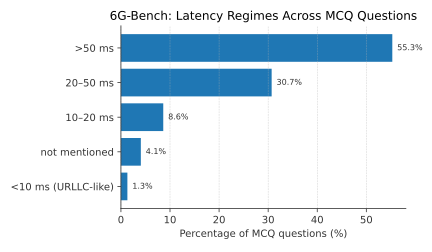
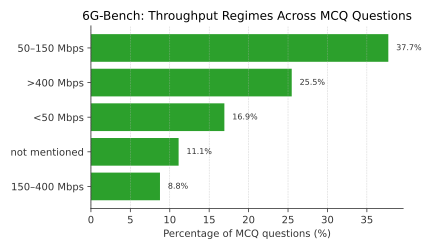
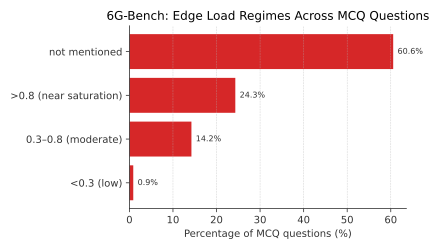

### Extremal Network Metrics

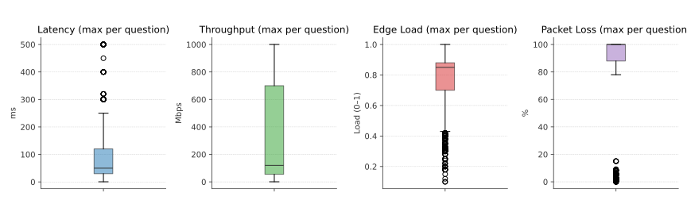

These plots highlight that many questions are instantiated under severe latency, edge-load, and reliability stress, aligning the benchmark with deployment-relevant 6G conditions.

---

## Models Evaluated

We evaluate a diverse suite of contemporary foundation models, spanning dense and Mixture-of-Experts architectures, short- and long-context designs, and both open-weight and proprietary systems.

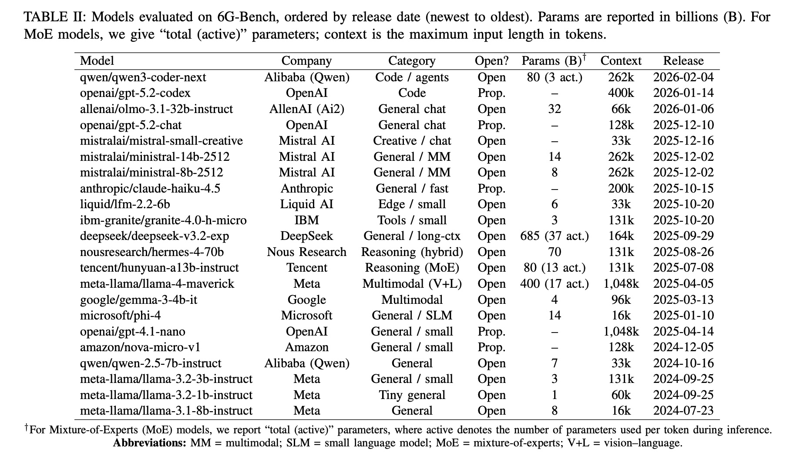

---

## Results

### Overall pass@k Performance

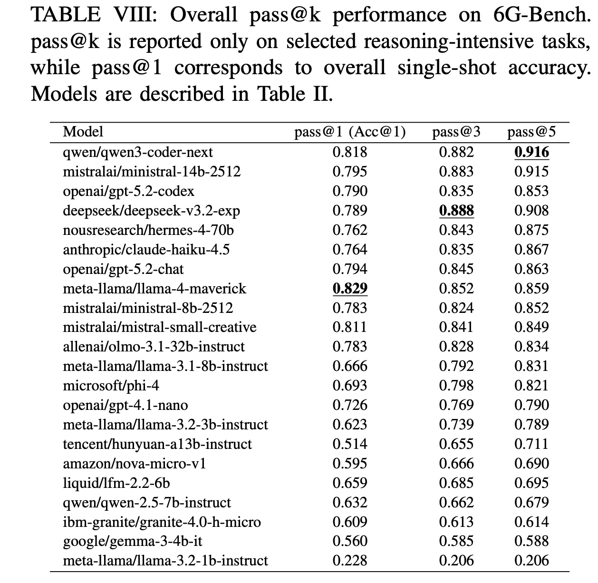

### pass@1 Accuracy by Model Scale

To better understand scaling behavior, we report pass@1 (single-shot accuracy) for different parameter regimes:

- **Large Models**

  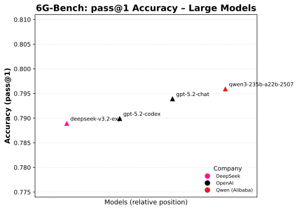

- **Medium Models**

  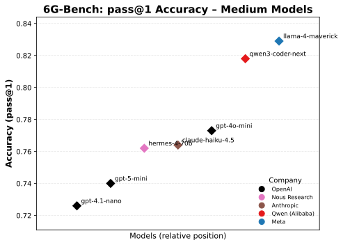

- **Small Models**

  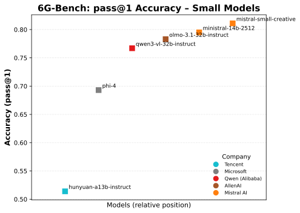

- **Tiny Models**

  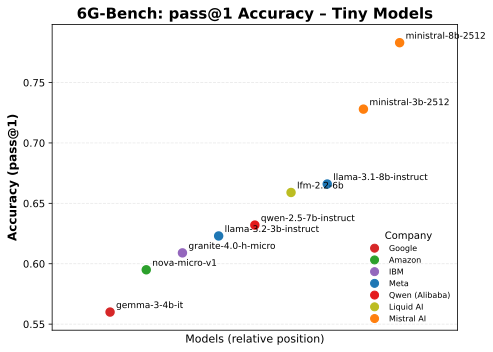

These visualizations show that:
- Some **mid-scale models** can match or outperform larger models on deterministic pass@1.
- **Trust-, security-, and distributed-intelligence tasks** remain among the most challenging categories.

## Citation
If you use **α³-Bench**, please cite:

```bibtex
@misc{ferrag6Gbench,
      title={....}, 
      author={Mohamed Amine Ferrag and Abderrahmane Lakas and Merouane Debbah},
      year={2026},
      eprint={...},
      archivePrefix={arXiv},
      primaryClass={cs.CR},
      url={https://arxiv.org/abs/....}, 
}
```

---

## Authors
- **Mohamed Amine Ferrag**  
- **Abderrahmane Lakas**  
- **Merouane Debbah**

---

## License
The dataset is released under the **Creative Commons Attribution 4.0 (CC BY 4.0)** license unless otherwise specified.

---

## Contact
For questions, issues, or collaboration:

<p align="center">
  <b>Dr. Mohamed Amine Ferrag</b><br>
  Associate Professor, Department of Computer and Network Engineering<br>
  College of Information Technology, United Arab Emirates University (UAEU)<br>
  Al Ain, United Arab Emirates<br><br>

  <a href="mailto:mohamed.amine.ferrag@gmail.com">mohamed.amine.ferrag@gmail.com</a><br>
  <a href="mailto:mohamed.ferrag@uaeu.ac.ae">mohamed.ferrag@uaeu.ac.ae</a><br><br>
</p>


  🌐 <a href="https://scholar.google.fr/citations?user=IkPeqxMAAAAJ&hl=fr&oi=ao">Google Scholar</a> |
  🔗 <a href="https://www.scopus.com/authid/detail.uri?authorId=56115001200">Scopus</a> |
  🧭 <a href="https://www.webofscience.com/wos/author/rid/M-2909-2016">Web of Science</a> |
  💼 <a href="https://www.linkedin.com/in/mohamed-amine-ferrag-phd-36390243/">LinkedIn</a>
</p>


---
